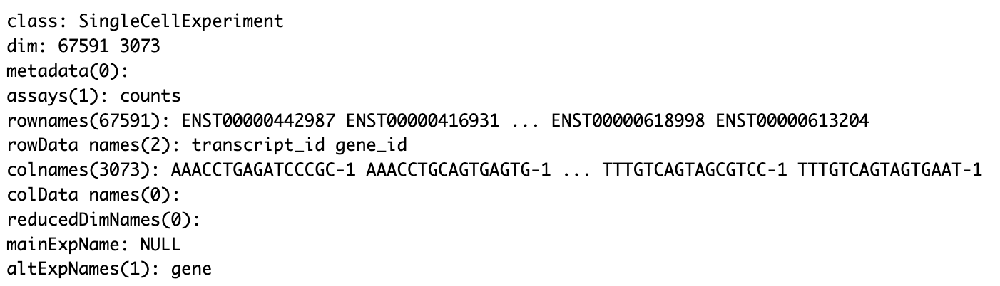
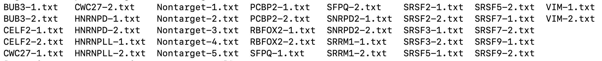
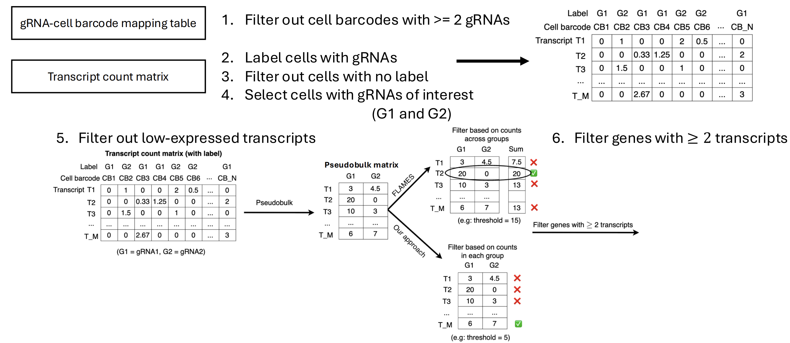
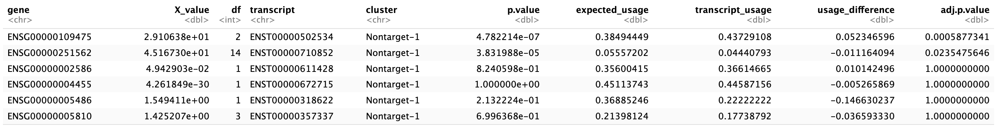
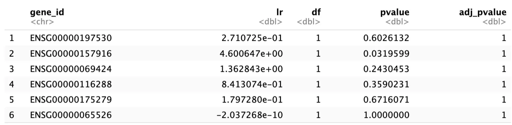
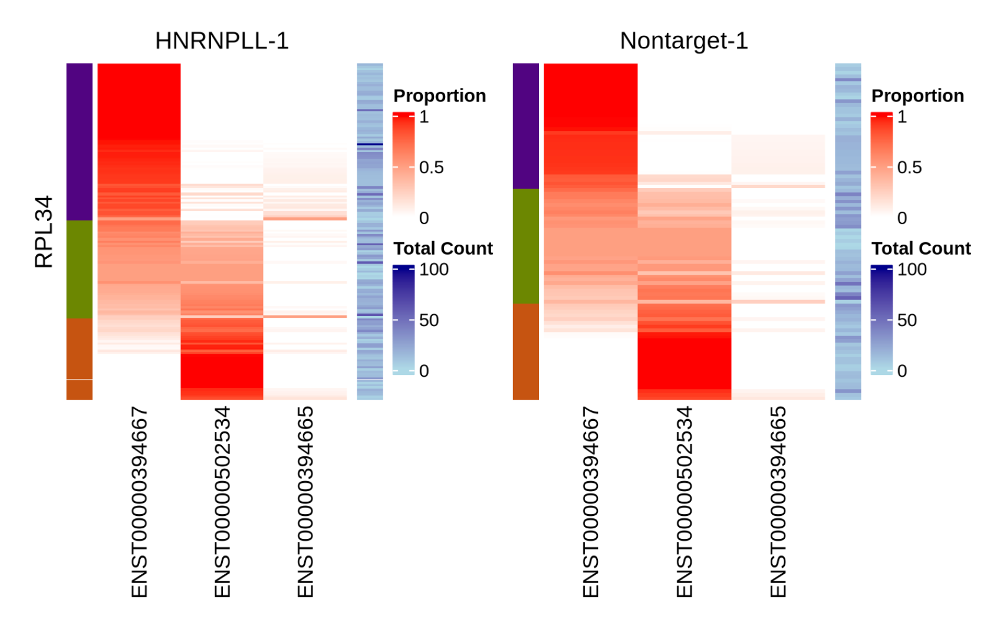

```{r, include = FALSE}
knitr::opts_chunk$set(
  collapse = TRUE,
  comment = "#>",
  eval = FALSE
)
```

## Introduction
Differential Transcript Usage (DTU) is an important aspect in investigating gene regulation. 
However, analysis related to this in CRISPR settings is limited. Therefore, 
we introduced `CRISPRana`, an R package for analyzing DTU in CRISPR-edited cells. This
package allows users to apply various statistical methods to test for differences in transcript
usage of genes between two groups of cells, each associated with a different gRNA.
There are three available methods: Chi-squared, Multinomial, and Dirichlet-multinomial.
We demonstrated the package pipeline on a sample of CRISPR-edited Jurkat cells and
evaluated the performance of each method on this dataset.

## Set-up
```{r setup}
library(CRISPRana)
```
The data is large, so it is impossible to include it into this vignette and the package. To address this, we precomputed the results and added them into the vignette. These code chunks below only show the `CRISPRana` pipeline and cannot be executed.


```{r}
long_read <- "~/Jurkat-CRISPR.fastq.gz"
cb_whitelist <- "~/Jurkat-CRISPR.barcodes.tsv.gz"
fa <- "~/Homo_sapiens.GRCh38.dna.primary_assembly.fa"
annot <- "~/Homo_sapiens.GRCh38.110.gtf"

sgRNA_data <- "~/JK_ASLV.txt"
R1 <- "~/sgRNA_R1.fastq"
R2 <- "~/sgRNA_R2.fastq"
```

## Preprocessing
At the preprocessing stage, we first call functions from `FLAMES` to generate the transcript count matrix. We only briefly shows them here, since these functions are inherited from `FLAMES` package. The vignette for `FLAMES` package can be found here: https://changqingw.github.io/IgniteRNAseq/articles/FLAMESWorkflow.html

We create a folder to store all the output files generated from the preprocessing step
```{r}
output <- "~/CRISPR_results"
if (!dir.exists(output)){
  dir.create(output)
}

# Create a config file to change the methods used in some steps such as
# transcript identification or transcript quantification
config <- create_config(output)
```

First, we extract the cell barcode and Unique Molecular Identifier
(UMI) from each read with the `find_barcode` function. This is necessary because single-cell sequencing
produces pooled reads from all cells, so we need this information to identify which cell each read
came from. Next, we use `minimap2_align` to align reads to the reference genome, identifying genomic
locations of reads. We then remove Polymerase Chain Reaction (PCR) duplicates using `quantify_gene`
function to reduce amplification bias in the quantification step. Subsequently, we detect known and
novel transcripts with `find_isoform` and align reads to these transcripts using `minimap2_realign`.
Finally, we use `quantify_transcript` to count how many reads mapped to each transcript. The
output is a transcript count matrix, where rows are transcripts and columns are cells.

```{r}
# Pattern with adjacent adapter sequences
protocol_pattern <- c(
  primer = "CTACACGACGCTCTTCCGATCT",
  BC = strrep('N', 16),
  UMI = strrep('N', 10),
  polyT = "TTTTTTTTT"
)

# Temporary directory for storing unzipped fastq/tsv files
outdir <- tempfile()
dir.create(outdir)

# Unzipping the cell barcode whitelist
bc_unzip <- file.path(outdir, "barcodes.tsv")
R.utils::gunzip(
  filename = cb_whitelist,
  destname = bc_unzip, remove = FALSE
)

# Unzipping the nanopore data file
f_unzip <- file.path(outdir, 'long.fq')
R.utils::gunzip(
  filename = long_read,
  destname = f_unzip, remove = FALSE
)

# Extracting cell barcodes and UMIs
find_barcode(
  f_unzip,
  stats_out = file.path(output, "bc_stat"),
  reads_out = file.path(output, "demultiplexed.fq"),
  barcodes_file = bc_unzip,
  pattern = protocol_pattern,
)

# Filtering GTF file
filter_gtf(annot, "~/filtered.gtf")
filtered_annot <- "~/filtered.gtf"

# Aligning to reference genome - Output: align2genome.bam
minimap2_align(
  config = config,
  fa_file = fa,
  fq_in = file.path(output, "demultiplexed.fq"),
  annot = filtered_annot,
  outdir = output,
  threads = 6
)

# Removing PCR duplicates - Output: matched_reads_dedup.fastq
quantify_gene(
  annotation=annot,
  outdir=output,
  infq=file.path(output, 'demultiplexed.fq'),
  n_process=1,
)

# Identifying transcripts: we can change the method to bambu in the config file
# by setting "bambu_isoform_identification" to true
find_isoform(
  annotation = filtered_annot,
  genome_fa = fa,
  genome_bam = file.path(output, "align2genome.bam"),
  outdir = output,
  config = config
)

# Aligning reads to transcripts
minimap2_realign(
  config = config,
  fq_in = file.path(output, "matched_reads_dedup.fastq"),
  outdir = outdir,
  thread = 6,
  sort_by = "CB"
)

# Quantifying transcripts: we can change the method to oarfish in the config 
# file by setting "oarfish_quantification" to true
sce <- quantify_transcript(
  annotation = annot,
  outdir = output,
  config = config,
  pipeline = "sc_single_sample"
)

sce
```
{#id .class width=500 height=200px}

For gRNA preprocessing, we use the `gRNA_assign` function with gRNA sequencing data to produce
gRNA-cell barcode mapping files, identifying which gene has been knocked out in each cell. `num_counts` is used as a threshold
for filtering out cells with low molecule counts. 
```{r}
gRNA_assign(
  ref_sgRNA = sgRNA_data, 
  gRNA_R1 = R1, 
  gRNA = R2, 
  CB_file = cb_whitelist, 
  cleared_CB = "~/cleared_barcodes.tsv", 
  num_counts = 10, 
  outdir = "~/CB_to_gRNA"
)
```
The output directory will look like this:

{#id .class width=600 height=100px}

where each file contains cell barcodes mapped to that gene.

## DTU analysis
Before using statistical methods for DTU analysis, we have a filtering step to select only the necessary
information. Both the filtering step and DTU analysis were implemented in the `sc_DTU_analysis` function. The image below shows the filtering pipeline. We can change the filtering strategy from `FLAMES` approach to `CRISPRana` by setting `filter_by_entry = TRUE`, and set the threshold for the transcript count in each group with `min_entry`.

{#id .class width=700 height=300px}

After the filtering step, we have 3 available statistical methods for DTU analysis: 
Chi-squared (`chisq`), Multinomial (`multi`), and Dirichlet-Multinomial (`dir-multi`). 

For example, to perform DTU analysis of genes between 2 groups HNRNPLL-1 and Nontarget-1 with the Chi-squared method and `FLAMES` filtering approach with threshold = 15, we run:
```{r}
result <- sc_DTU_analysis(
  sce = sce,
  gRNA_dir = "~/CB_to_gRNA",
  method = "chisq",
  gRNA1 = "HNRNPLL-1",
  gRNA2 = "Nontarget-1",
  min_count = 15
)
head(result)
```
{#id .class width=700 height=120px}

To perform the analysis with the Dirichlet-Multinomial method and `CRISPRana` filtering approach
with threshold = 5, we run:
```{r}
result <- sc_DTU_analysis(
  sce = sce,
  gRNA_dir = "~/CB_to_gRNA",
  method = "dir-multi",
  gRNA1 = "HNRNPLL-1",
  gRNA2 = "Nontarget-1",
  filter_by_entry = TRUE,
  min_entry = 5
)
head(result)
```
{#id .class width=500 height=120px}

## Visualizations
The visualization function `plot_heatmap` plots two heatmaps illustrating cell-level transcript usage patterns of a gene (`gene`) in two gRNA groups (`c1` and `c2`). Starting with the filtered transcript count matrix of cells within two specific gRNA groups, we extract a sub-matrix for a gene of interest. We then normalize transcript expression within each cell to generate a matrix of cell-level relative transcript usage. The heatmap shows the
transpose of the matrix, where rows represent cells and columns are transcripts.
However, by using the proportion matrix, we lose information about the gene count of each cell, which
is important to assess the variability across cells. To handle this, we add a column on the right of
the heatmap to show this information for each cell. Finally, we cluster cells from both groups using
K-means with k = `n_clusters`.

For example, if we want to plot 2 heatmaps showing the cell-level transcript usage of gene RPL34 in 2 groups HNRNPLL-1 and Nontarget-1, with 3 clusters for K-means, we run:
```{r}
final_sce <- filter_single_gRNA_cells(sce, "~/CB_to_gRNA")
plot_heatmap(
  final_sce = final_sce,
  c1 = "HNRNPLL-1",
  c2 = "Nontarget-1",
  gene = "RPL34",
  annot = annot,
  n_clusters = 3,
  random_seed = 0
)
```
{#id .class width=400 height=300px}
